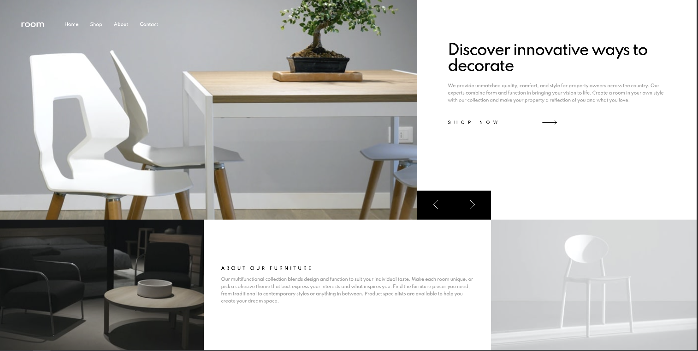

# Frontend Mentor - Room homepage solution

This is a solution to the [Room homepage challenge on Frontend Mentor](https://www.frontendmentor.io/challenges/room-homepage-BtdBY_ENq). Frontend Mentor challenges help you improve your coding skills by building realistic projects.

## Table of contents

- [Overview](#overview)
  - [The challenge](#the-challenge)
  - [Screenshot](#screenshot)
  - [Links](#links)
- [My process](#my-process)
  - [Built with](#built-with)
  - [What I learned](#what-i-learned)
- [Author](#author)

## Overview

### The challenge

Users should be able to:

- View the optimal layout for the site depending on their device's screen size
- See hover states for all interactive elements on the page
- Navigate the slider using either their mouse/trackpad or keyboard

### Screenshot

### Links

- Live Site URL: [link](https://room-carousel.vercel.app/)

## My process

### Built with

- Semantic HTML5 markup
- CSS custom properties
- Flexbox
- CSS Grid
- CSS Animations
- Vanilla JS
- Desktop-first workflow

### What I learned

I feel like I have a fairly solid process for creating full-width carousels now. Especially when it comes to adding interesting animations/transitions to them. The process is as follows:

- create the track
- write markup for each "slide"
- set all slides to position absolute
- use vanilla js to grab size of images and place them next to each other so when the slider buttons are pressed, the slides translateX the amount of the slide width and moves forward/backward based on if the forward/previous buttons are pressed

## Author

- Website - [Jeff Jakinovich](http://jeffjakinovich.com/)
- Frontend Mentor - [@jljakin2](https://www.frontendmentor.io/profile/jljakin2)
- LinkedIn - [Jeff Jakinovich](https://www.linkedin.com/in/jeff-jakinovich-b6b14943/)
